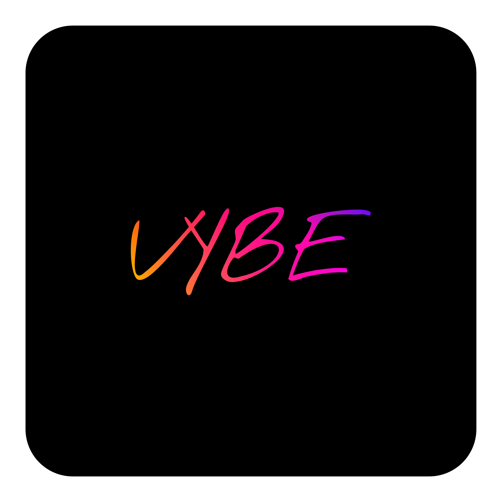

# ⚡ **Vybe - Modern Social Media Platform (MERN + Socket.IO)**

<div align="center">
  

### *Connect. Create. Share. Vybe.*

  <br/>

  <!-- Shields -->

  
  
  
  
  

<br/><br/>

Vybe is a next-generation social media platform engineered for **real-time interaction**,
**storytelling**, and **community-driven content**, built using the latest MERN technologies. 

</div>

---

# 🌟 **Overview**

Vybe delivers a powerful, modern social networking experience - including **posts, stories, loops (community feature), real-time chat**, user profiles, notifications, and media uploads - all designed with a lightning-fast UI powered by React 19 + Vite and real-time backend powered by Node.js, Express, MongoDB & Socket.IO.

Vybe is not just a clone - it’s a **full-feature production-level social media platform**, built to scale and structured with clean architecture.

---

# ✨ **Core Features**

## 🔐 **Authentication & User Security**

* JWT authentication with refresh logic
* Encrypted passwords using bcrypt
* Protected routes & API authorization
* Email verification (Nodemailer)
* Secure session handling

## 📝 **Content System**

* Create, edit, delete posts
* Upload images & videos (Cloudinary)
* Like, comment & engage on posts
* Story system with 24-hour expiry
* Drafts & autosave support

## 💬 **Real-Time Messaging**

* One-to-one chat (Socket.IO)
* Online user status
* Typing indicators
* Media support in chats
* Delivery & read receipts

## 👥 **Networking**

* “Loops” (community groups)
* Follow/Unfollow users
* Suggested users
* Activity feed
* Notifications system

## 🎨 **UI/UX**

* Fully responsive interface
* Modern layouts using TailwindCSS
* Smooth animations with Framer Motion
* Dark/Light modes
* Optimized for mobile & desktop

## 🚀 **Technical**

* React 19 + Vite for performance
* Redux Toolkit for scalable state management
* RESTful backend (Express)
* Cloudinary for media handling
* Socket.IO server for true real-time
* Clean modular architecture

---

# 🛠 **Tech Stack**

## 🎯 Frontend

| Technology           | Purpose                 |
| -------------------- | ----------------------- |
| **React 19**         | Main UI framework       |
| **Vite**             | Super-fast bundler      |
| **Redux Toolkit**    | Global state management |
| **Tailwind CSS**     | Styling                 |
| **Framer Motion**    | Animations              |
| **Axios**            | API communication       |
| **React Router v7**  | Routing                 |
| **Socket.IO Client** | Real-time chat          |

## ⚙️ Backend

| Technology             | Purpose                 |
| ---------------------- | ----------------------- |
| **Node.js**            | Runtime                 |
| **Express.js**         | Server framework        |
| **MongoDB + Mongoose** | Database                |
| **Socket.IO**          | Real-time communication |
| **Cloudinary**         | File storage            |
| **Nodemailer**         | Email transport         |
| **JWT**                | Authentication          |
| **bcrypt**             | Password hashing        |

---

# 🏗 **Project Structure**

```
vybe-social-media/
├── Client/                 # Frontend (React + Vite)
│   ├── public/
│   ├── src/
│   │   ├── assets/
│   │   ├── components/
│   │   ├── hooks/
│   │   ├── pages/
│   │   ├── redux/
│   │   └── App.jsx
│   └── ...
│
└── Server/                 # Backend (Node.js + Express)
    ├── config/
    ├── controllers/
    ├── middleware/
    ├── models/
    ├── routes/
    ├── utils/
    └── server.js
```

---

# ⚙️ **Environment Setup**

## Backend (`Server/.env`)

```env
PORT=5000
MONGODB_URI=your_connection_string

JWT_SECRET=your_jwt_secret

CLOUDINARY_CLOUD_NAME=your_cloud_name
CLOUDINARY_API_KEY=your_api_key
CLOUDINARY_API_SECRET=your_api_secret

EMAIL_USER=your_email@gmail.com
EMAIL_PASS=your_email_password

FRONTEND_URL=http://localhost:5173
```

## Frontend (`Client/.env`)

```env
VITE_API_BASE_URL=http://localhost:5000/api
VITE_SOCKET_URL=http://localhost:5000
```

---

# 🚀 **Getting Started**

### 1️⃣ Clone Repository

```bash
git clone https://github.com/your-username/vybe-social-media.git
cd vybe-social-media
```

### 2️⃣ Install Dependencies

#### Backend

```bash
cd Server
npm install
```

#### Frontend

```bash
cd ../Client
npm install
```

### 3️⃣ Run Development Servers

#### Backend

```bash
cd Server
npm run dev
```

#### Frontend

```bash
cd ../Client
npm run dev
```

### 🎉 On system links!

* **Frontend:** [http://localhost:5173](http://localhost:5173)
* **Backend API:** [http://localhost:5000](http://localhost:5000)

---

# 📸 **Preview**


<div align="center">

### 🏠 Home Feed

  

  

### 💬 Chat

  

### 📱 Mobile View

  

  

</div>


---

# 🔮 **Future Improvements**

* AI-powered feed ranking
* Video compression before upload
* Group chats + voice messages
* Push notifications (FCM)
* Offline-first caching
* Enhanced analytics dashboard
* Endless scroll performance upgrades

---

# 🤝 **Contributing**

We welcome contributions!

1. Fork the repo
2. Create a branch (`feature/YourFeature`)
3. Commit changes
4. Push & open PR

💡 Follow clean code practices and meaningful commit messages.

---

## 📝 License

This project is licensed under the **MIT License**.
See the [LICENSE](/LICENSE) file for details.

---

## 📬 Contact

👤 **Pranav Thorat**

| Platform              | Link                                                          |
| --------------------- | ------------------------------------------------------------- |
| 🌐 **Live Demo**      | [View Now]()                        |
| 🧑‍💻 **GitHub Repo** | [View Code](https://github.com/PranavThorat1432/LinkedIn-Full-Stack-Clone-using-MERN-) |
| 💼 **LinkedIn**       | [Connect with Me](https://www.linkedin.com/in/curiouspranavthorat/)       |
| 📩 **Email**          | [pranavthorat95@gmail.com](mailto:pranavthorat95@gmail.com)   |

---

## 🌟 Support

If you liked this project, please give it a ⭐️ on GitHub - it helps others find it!


</div>


